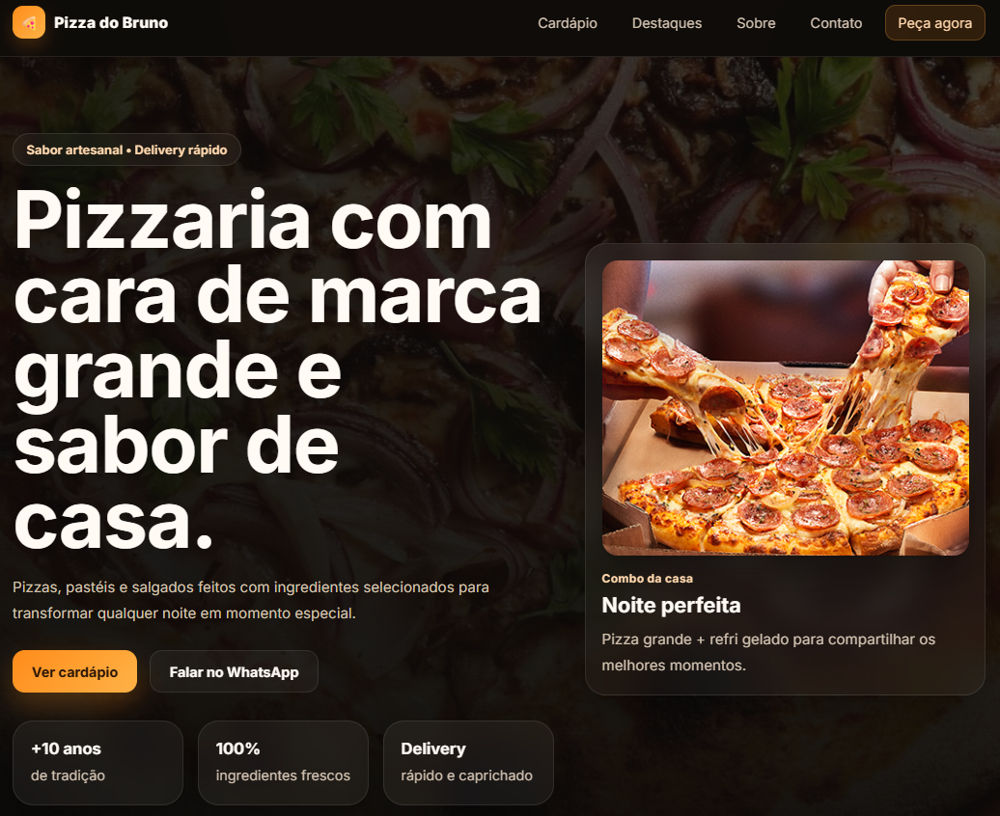

# 🍕 Pizzaria Web - Frontend Profissional

<p align="center">
  
</p>

<p align="center">
  <a href="https://SEU-LINK-AQUI.vercel.app" target="_blank">
    
  </a>
</p>

---

## ✨ Sobre o projeto

Este projeto foi desenvolvido com foco em **experiência do usuário, design moderno e performance**, simulando uma aplicação real de uma pizzaria digital.

A ideia foi criar uma interface **atrativa, rápida e responsiva**, aplicando boas práticas de desenvolvimento front-end.

---

## 🧠 O que foi aplicado

- Estrutura semântica com HTML5
- Estilização moderna com CSS3
- Layout responsivo (mobile first 📱)
- Manipulação de DOM com JavaScript
- Componentização simples
- Organização de código limpa
- Boas práticas de UI/UX

---

## 🚀 Funcionalidades

- 🍕 Listagem dinâmica de pizzas
- 🔎 Filtro por categorias
- 🛒 Interface preparada para carrinho
- 📱 Design responsivo
- ⚡ Carregamento rápido

---

## 🛠️ Tecnologias utilizadas

<p align="center">
  
</p>

---

## 📂 Estrutura do projeto
pizzaria/
├── assets/
├── css/
├── js/
├── index.html
└── README.md

---

## 🧪 Como rodar o projeto

```bash
# Clone o repositório
git clone https://github.com/SEU-USUARIO/SEU-REPO.git

# Acesse a pasta
cd pizzaria

# Abra o arquivo index.html no navegador ou utilize Live Server
```